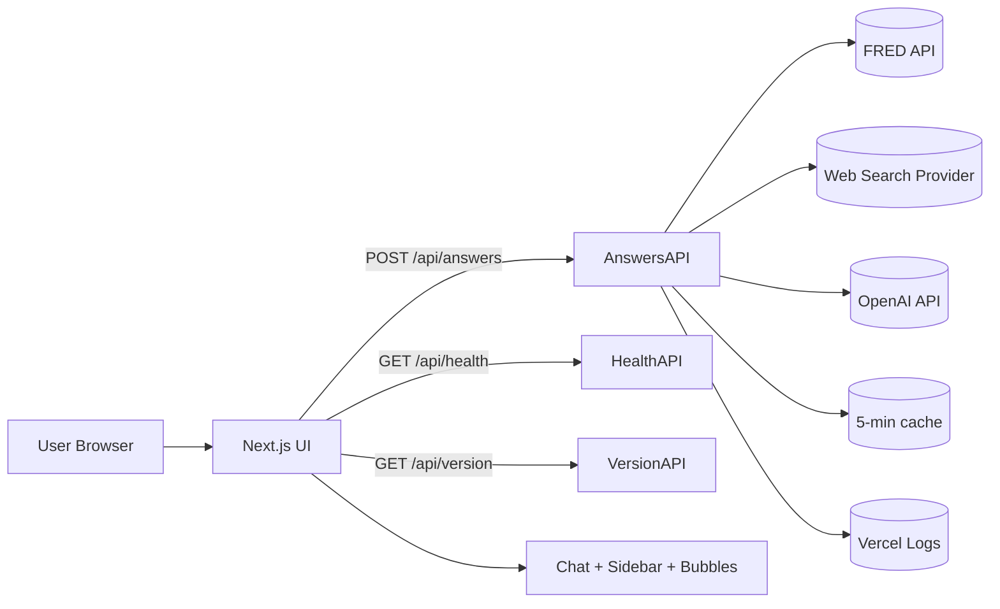
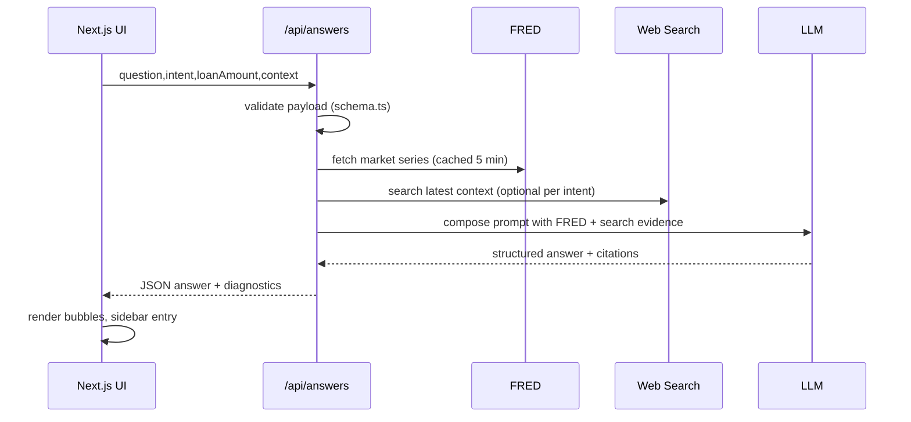
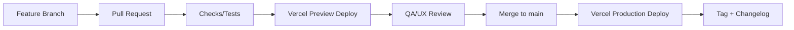

# HomeRates-Next — Architecture (Version 2.0)
**Tag:** HR-Next-v2.0-2025-10-15  
**Last updated:** 2025-10-15 19:09:45 (local build timestamp)

## 1) Purpose & Scope
HomeRates-Next is the Next.js-based evolution of the HomeRates.ai chat experience. It delivers a borrower-first Q&A with market context (FRED data, search enrichment) and a clean, fast ChatGPT-style UI. This doc keeps engineering, product, and ops in sync.

**Goals**
- Ship a reliable two-column Chat UI with sidebar history, sticky header, and fast responses.
- Enrich answers with macro data (FRED) and web context (Tavily/other).
- Keep deployments deterministic and observable on Vercel.
- Track versions with semantic tags and dated milestones.

**Non-Goals (for now)**
- Auth, multi-tenant orgs, team workspaces (tracked in roadmap).
- Heavy analytics pipeline beyond simple logs/metrics.
- CMS authoring; we use static assets + code for now.

---

## 2) High-Level Architecture
- **Frontend:** Next.js (App Router), React Server Components where helpful, client components for chat.
- **APIs (Edge/Node):** `/app/api/answers`, `/app/api/health`, `/app/api/version`.
- **External Data:** FRED API for rates/10y Treasury; web search (Tavily or alternate) for current context.
- **Hosting:** Vercel (Preview & Production).
- **State:** Local client state for session; server inference stateless per request (option to persist later).
- **Observability:** Simple console logs + Vercel function logs; add tracing hooks later.



---

## 3) Repos, Environments & Branching
- **Repo:** `homerates-ui-next` (GitHub).
- **Branching:**
  - `main` → Production (tagged releases only)
  - `dev` → active work; PRs from feature branches
  - `feat/*` → short-lived feature branches
- **Vercel:**
  - Preview from PRs
  - Production from `main` (protected)

**Version Tag Convention**
- `HR-Next-vX.Y-YYYY-MM-DD`  
  Example for this cut: `HR-Next-v2.0-2025-10-15`

---

## 4) Directory Structure (App Router)
```
/app
  /api
    /answers/route.ts        # Core chat endpoint (Edge or Node)
    /health/route.ts         # Health check
    /version/route.ts        # Build sha, tag, time
  /chat/page.tsx             # Chat UI page (2-column layout)
  /layout.tsx                # Global layout (header, sidebar slot)
  /globals.css               # Global styles
/components
  ChatInput.tsx
  MessageList.tsx
  MessageBubble.tsx
  SidebarHistory.tsx
  LoadingDots.tsx
/lib
  fred.ts                    # FRED client + caching
  search.ts                  # Web search wrapper
  llm.ts                     # LLM call orchestration
  cache.ts                   # Simple in-memory or edge cache facade
  schema.ts                  # Zod schemas for API payloads
/public
  /assets
    homerates-mark.svg
    homerates-wordmark.svg
  favicon.ico
/docs
  Architecture.md            # This doc
  ADR-001-runtime.md         # Decision: Edge vs Node runtime
  ADR-002-search-provider.md # Decision: Tavily vs other
```

---

## 5) API Contracts

### POST /api/answers
**Request**
```json
{
  "intent": "concept|market|dynamic",
  "question": "string",
  "loanAmount": 750000,
  "context": {
    "geo": "CA",
    "persona": "firstTimeBuyer|homeowner|investor"
  }
}
```
**Response (shape example)**
```json
{
  "answer": "string (markdown-ready)",
  "sources": [{"type":"fred","id":"DGS10","asOf":"2025-10-09"},
              {"type":"web","url":"...", "title":"..."}],
  "diagnostics": {
    "llmModel": "gpt-4.1-mini|gpt-5...",
    "latencyMs": 850,
    "cache": "hit|miss"
  }
}
```

### GET /api/health
- Returns `200` + `{ ok: true, now, version }`

### GET /api/version
- Returns build SHA, tag, deploy time, and environment.

---

## 6) Data Flow (Answers)


---

## 7) Environment Variables
```
OPENAI_API_KEY=...
FRED_API_KEY=...
SEARCH_API_KEY=...      # e.g., Tavily
DYNAMIC_ENABLED=true    # feature flag for dynamic intent
LOG_LEVEL=info|debug
```

**Secrets Management**
- Stored in Vercel Project → Settings → Environment Variables
- `Preview` and `Production` have separate values if needed

---

## 8) Runtime, Caching & Performance
- **Runtime:** Prefer Edge for low-latency reads; fall back to Node for larger deps.
- **Caching:**
  - FRED responses memoized for 5 minutes
  - Web search results optionally cached 5–10 minutes per query
  - HTTP cache headers on static assets
- **Streaming:** Enable incremental streaming for LLM responses (TBD).

---

## 9) Error Handling & Guardrails
- **User-visible:** Friendly error bubble (“We hit a snag. Try again or rephrase.”)
- **Server:** Structured logs with request id, latency, provider status codes
- **Backoff:** Retry FRED/search transient 500s with jitter
- **Rate Limits:** Soft cap per IP/session; escalate with 429 + Retry-After

---

## 10) Observability
- Vercel function logs for API routes
- `x-request-id` attached to every response for support threads
- Optional: lightweight metrics counter (requests, errors, cache hits)

---

## 11) Security
- No PII beyond chat text; redact phone/email if echoed
- Disallow arbitrary URLs in client to prevent SSRF
- Validate all request bodies (Zod) and clamp lengths
- CORS limited to project domains

---

## 12) UI/UX Checklist
- Two-column layout, responsive
- Sidebar history (stub → persisted later)
- Sticky header with logo + environment/version
- Message bubbles with markdown + code styling
- Empty states and helpful prompts
- Keyboard: Enter to send, Shift+Enter for newline
- Footer shows deployed version/time for “is latest live?” checks

---

## 13) Testing
- **Unit:** schema validation, formatters, prompt composers
- **Integration:** /api/answers with mocked FRED/search
- **Smoke:** Health & Version endpoints on every deploy
- **Manual:** “Latest build” banner shows tag + timestamp

---

## 14) Deployment Pipeline


**Release Steps**
1. Merge PR → Preview deploy.
2. Verify health/version; quick UX pass.
3. Merge to `main` → Production deploy.
4. Tag commit: `git tag -a HR-Next-v2.0-2025-10-15 -m "UI shell + endpoints"` then `git push --tags`.
5. Update `CHANGELOG.md`.

---

## 15) Files to Add (Docs & Ops)
- `/docs/Architecture.md` (this file)
- `/docs/ADR-001-runtime.md` (Edge vs Node rationale)
- `/docs/ADR-002-search-provider.md` (Tavily vs alt)
- `/CHANGELOG.md` (human-readable releases)
- `/DECISIONS.md` (running list of non-ADR decisions)
- `/RUNBOOK.md` (how to diagnose a “white page”, env checks, cache flush)
- `/docs/handbook/90-sec-handoff.md` (template below)

**90-sec Handoff Template**
```
Status
- Build: green. SHA: <short>. Env: Preview|Prod.
- Endpoints: /api/answers, /api/health, /api/version OK.
- UI: two-column shell live; sidebar/history = stub.

Gaps / Next
- Tone polish + “Next:” lines in answers.
- Sidebar persistence; error toasts; streaming.
- Observability: request id surfacing; simple metrics.

Links
- Preview: <url>
- Health: <url>/api/health
- Version: <url>/api/version
```

---

## 16) Roadmap (near-term)
- [ ] Sidebar history persistence (localStorage → server)
- [ ] Streaming answers with partial tokens
- [ ] Rate-limit + error toasts
- [ ] Simple metrics board (requests, errors, cache)
- [ ] Agent/borrower presets (top 5 prompts)
- [ ] Save/Share answer snapshots

## 17) Glossary
- **FRED:** Federal Reserve Economic Data.
- **RSC:** React Server Components.
- **ADR:** Architecture Decision Record.
- **Preview:** Vercel environment from PRs.
- **Production:** Vercel environment tied to `main`.
